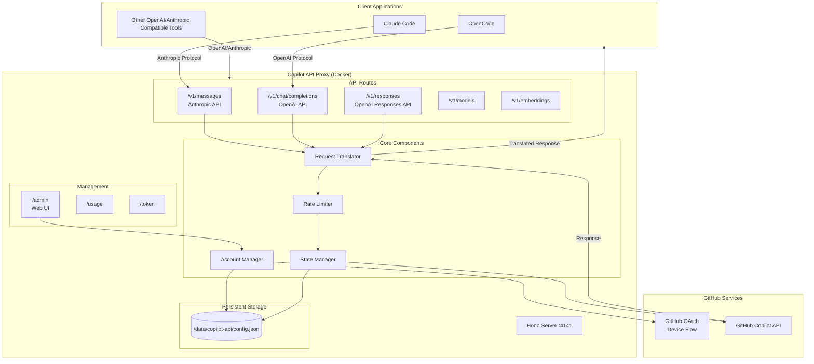
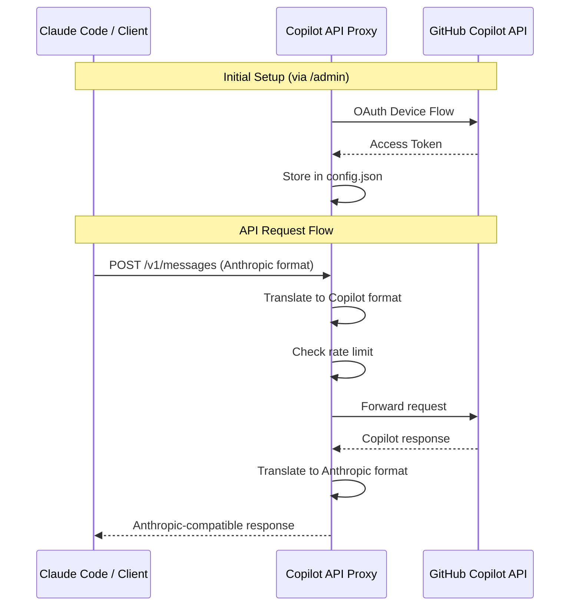

# Copilot API Proxy

**English | [中文](README.zh-CN.md)**

> [!NOTE]
> **About This Fork**
> This project is forked from [ericc-ch/copilot-api](https://github.com/ericc-ch/copilot-api). Since the original author has discontinued maintenance and no longer supports the new API, we have redesigned and rewritten it.
> Special thanks to [@ericc-ch](https://github.com/ericc-ch) for the original work and contribution!

> [!WARNING]
> This is a reverse-engineered proxy of GitHub Copilot API. It is not supported by GitHub, and may break unexpectedly. Use at your own risk.

> [!WARNING]
> **GitHub Security Notice:**  
> Excessive automated or scripted use of Copilot (including rapid or bulk requests, such as via automated tools) may trigger GitHub's abuse-detection systems.  
> You may receive a warning from GitHub Security, and further anomalous activity could result in temporary suspension of your Copilot access.
>
> GitHub prohibits use of their servers for excessive automated bulk activity or any activity that places undue burden on their infrastructure.
>
> Please review:
>
> - [GitHub Acceptable Use Policies](https://docs.github.com/site-policy/acceptable-use-policies/github-acceptable-use-policies#4-spam-and-inauthentic-activity-on-github)
> - [GitHub Copilot Terms](https://docs.github.com/site-policy/github-terms/github-terms-for-additional-products-and-features#github-copilot)
>
> Use this proxy responsibly to avoid account restrictions.

---

**Note:** If you are using [opencode](https://github.com/sst/opencode), you do not need this project. Opencode supports GitHub Copilot provider out of the box.

---

## Project Overview

A reverse-engineered proxy for the GitHub Copilot API that exposes it as an OpenAI and Anthropic compatible service. This allows you to use GitHub Copilot with any tool that supports the OpenAI Chat Completions API or the Anthropic Messages API, including [Claude Code](https://docs.anthropic.com/en/docs/claude-code/overview).

## Architecture



## Request Flow



## Features

- **OpenAI & Anthropic Compatibility**: Exposes GitHub Copilot as an OpenAI-compatible (`/v1/chat/completions`, `/v1/models`, `/v1/embeddings`, `/v1/responses`) and Anthropic-compatible (`/v1/messages`) API.
- **Web-based Account Management**: Add and manage multiple GitHub accounts through a simple web interface at `/admin`.
- **Multi-Account Support**: Switch between different GitHub accounts without restarting the server.
- **Docker-First Deployment**: Optimized for containerized deployment with persistent data storage.
- **Usage Monitoring**: View your Copilot API usage and quota information via `/usage` endpoint.
- **Rate Limit Control**: Manage API usage with rate-limiting options to prevent errors from rapid requests.
- **Support for Different Account Types**: Works with individual, business, and enterprise GitHub Copilot plans.

## Quick Start with Docker

### Using Docker Compose (Recommended)

```bash
# Clone the repository
git clone https://github.com/yuegongzi/copilot-api.git
cd copilot-api

# Start the server
docker compose up -d

# View logs
docker compose logs -f
```

Then visit **http://localhost:4141/admin** to add your GitHub account.

### Using Docker Run

```bash
docker run -d \
  --name copilot-api \
  -p 4141:4141 \
  -v copilot-data:/data \
  --restart unless-stopped \
  ghcr.io/yuegongzi/copilot-api:latest
```

## Account Setup

1. Start the server using Docker
2. Open **http://localhost:4141/admin** in your browser (must be accessed from localhost)
3. Click "Add Account" to start the GitHub OAuth device flow
4. Enter the code shown on GitHub's device authorization page
5. Your account will be automatically configured once authorized

The admin panel allows you to:

- Add multiple GitHub accounts
- Switch between accounts
- Remove accounts
- View account status (individual/business/enterprise)

## Environment Variables

| Variable | Default | Description |
|----------|---------|-------------|
| `PORT` | `4141` | Server port |
| `VERBOSE` | `false` | Enable verbose logging (also accepts `DEBUG=true`) |
| `RATE_LIMIT` | - | Minimum seconds between requests |
| `RATE_LIMIT_WAIT` | `false` | Wait instead of error when rate limit is hit |
| `SHOW_TOKEN` | `false` | Display tokens in logs |
| `PROXY_ENV` | `false` | Use `HTTP_PROXY`/`HTTPS_PROXY` from environment |

### Docker Compose Example with Options

```yaml
services:
  copilot-api:
    image: ghcr.io/yuegongzi/copilot-api:latest
    container_name: copilot-api
    ports:
      - "4141:4141"
    volumes:
      - copilot-data:/data
    environment:
      - PORT=4141
      - VERBOSE=true
      - RATE_LIMIT=5
      - RATE_LIMIT_WAIT=true
    restart: unless-stopped

volumes:
  copilot-data:
```

## API Endpoints

### OpenAI Compatible Endpoints

| Endpoint | Method | Description |
|----------|--------|-------------|
| `/v1/responses` | `POST` | OpenAI Responses API for generating model responses |
| `/v1/chat/completions` | `POST` | Chat completions API |
| `/v1/models` | `GET` | List available models |
| `/v1/embeddings` | `POST` | Create text embeddings |

### Anthropic Compatible Endpoints

| Endpoint | Method | Description |
|----------|--------|-------------|
| `/v1/messages` | `POST` | Anthropic Messages API |
| `/v1/messages/count_tokens` | `POST` | Token counting |

### Management Endpoints

| Endpoint | Method | Description |
|----------|--------|-------------|
| `/admin` | `GET` | Account management Web UI (localhost only) |
| `/usage` | `GET` | Copilot usage statistics and quota |
| `/token` | `GET` | Current Copilot token |

## Using with Claude Code

Configure Claude Code to use this proxy by creating a `.claude/settings.json` file:

```json
{
  "env": {
    "ANTHROPIC_BASE_URL": "http://localhost:4141",
    "ANTHROPIC_AUTH_TOKEN": "sk-xxxx",
    "ANTHROPIC_DEFAULT_HAIKU_MODEL": "claude-haiku-4.5",
    "ANTHROPIC_DEFAULT_SONNET_MODEL": "claude-sonnet-4.5",
    "ANTHROPIC_DEFAULT_OPUS_MODEL": "claude-opus-4.5",
    "CLAUDE_CODE_SUBAGENT_MODEL": "claude-sonnet-4.5"
  },
  "model": "opus",
  "permissions": {
    "deny": ["WebSearch"]
  }
}
```

More options: [Claude Code settings](https://docs.anthropic.com/en/docs/claude-code/settings#environment-variables)

## Configuration (config.json)

The configuration file is stored at `/data/copilot-api/config.json` inside the container (persisted via Docker volume).

```json
{
  "accounts": [
    {
      "id": "12345",
      "login": "github-user",
      "avatarUrl": "https://...",
      "token": "gho_xxxx",
      "accountType": "individual",
      "createdAt": "2025-01-27T..."
    }
  ],
  "activeAccountId": "12345",
  "extraPrompts": {
    "gpt-5-mini": "<exploration prompt>"
  },
  "smallModel": "gpt-5-mini",
  "modelReasoningEfforts": {
    "gpt-5-mini": "low"
  }
}
```

### Configuration Options

| Key | Description |
|-----|-------------|
| `accounts` | List of configured GitHub accounts |
| `activeAccountId` | Currently active account ID |
| `extraPrompts` | Per-model prompts appended to system messages |
| `smallModel` | Fallback model for warmup requests (default: `gpt-5-mini`) |
| `modelReasoningEfforts` | Per-model reasoning effort (`none`, `minimal`, `low`, `medium`, `high`, `xhigh`) |

## Development

### Prerequisites

- Bun >= 1.2.x
- GitHub account with Copilot subscription

### Commands

```bash
# Install dependencies
bun install

# Start development server (with hot reload)
bun run dev

# Type checking
bun run typecheck

# Linting
bun run lint
bun run lint --fix

# Run tests
bun test

# Production build
bun run build

# Check for unused code
bun run knip
```

## Usage Tips

- **Rate Limiting**: Use `RATE_LIMIT` to prevent hitting GitHub's rate limits. Set `RATE_LIMIT_WAIT=true` to queue requests instead of returning errors.
- **Business/Enterprise Accounts**: The account type is automatically detected during OAuth flow.
- **Multiple Accounts**: Add multiple accounts via `/admin` and switch between them as needed.

## CLAUDE.md Recommended Content

Please include the following in `CLAUDE.md` (for Claude usage):

- Prohibited from directly asking questions to users, MUST use AskUserQuestion tool.
- Once you can confirm that the task is complete, MUST use AskUserQuestion tool to make user confirm. The user may respond with feedback if they are not satisfied with the result, which you can use to make improvements and try again.
