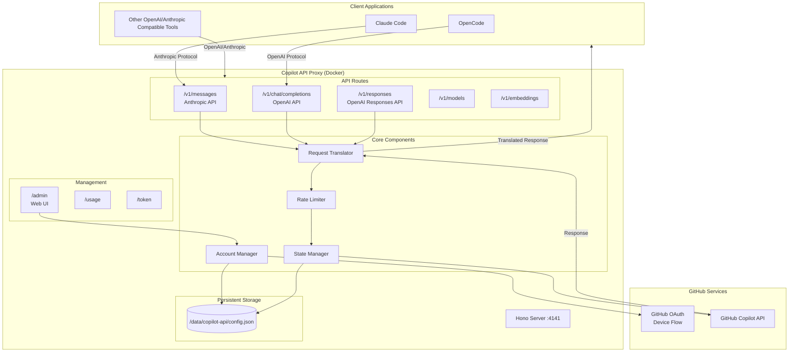
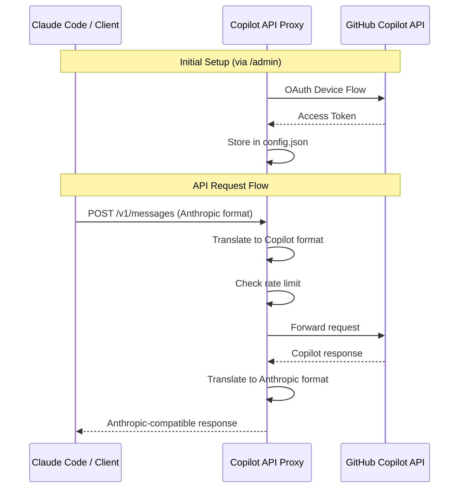

# Copilot API Proxy

**English | [中文](README.zh-CN.md)**

> [!NOTE]
> **About This Fork**
> This project is forked from [ericc-ch/copilot-api](https://github.com/ericc-ch/copilot-api) and [yuegongzi/copilot-api](https://github.com/yuegongzi/copilot-api). Since the original author has discontinued maintenance and no longer supports the new API, we have redesigned and rewritten it.
> Special thanks to [@ericc-ch](https://github.com/ericc-ch) and [@yuegongzi](https://github.com/yuegongzi) for the original work and contribution!

> [!WARNING]
> This is a reverse-engineered proxy of GitHub Copilot API. It is not supported by GitHub, and may break unexpectedly. Use at your own risk.

> [!WARNING]
> **GitHub Security Notice:**  
> Excessive automated or scripted use of Copilot (including rapid or bulk requests, such as via automated tools) may trigger GitHub's abuse-detection systems.  
> You may receive a warning from GitHub Security, and further anomalous activity could result in temporary suspension of your Copilot access.
>
> GitHub prohibits use of their servers for excessive automated bulk activity or any activity that places undue burden on their infrastructure.
>
> Please review:
>
> - [GitHub Acceptable Use Policies](https://docs.github.com/site-policy/acceptable-use-policies/github-acceptable-use-policies#4-spam-and-inauthentic-activity-on-github)
> - [GitHub Copilot Terms](https://docs.github.com/site-policy/github-terms/github-terms-for-additional-products-and-features#github-copilot)
>
> Use this proxy responsibly to avoid account restrictions.

---

**Note:** If you are using [opencode](https://github.com/sst/opencode), you do not need this project. Opencode supports GitHub Copilot provider out of the box.

---

## Project Overview

A reverse-engineered proxy for the GitHub Copilot API that exposes it as an OpenAI and Anthropic compatible service. This allows you to use GitHub Copilot with any tool that supports the OpenAI Chat Completions API or the Anthropic Messages API, including [Claude Code](https://docs.anthropic.com/en/docs/claude-code/overview).

## Architecture


```mermaid
flowchart TB
    subgraph Clients["Client Applications"]
        CC[Claude Code]
        OC[OpenCode]
        OTHER[Other OpenAI/Anthropic Compatible Tools]
    end

    subgraph Proxy["Copilot API Proxy (Docker)"]
        direction TB
        SERVER[Hono Server :4141]
        
        subgraph Routes["API Routes"]
            ANTHROPIC["/v1/messages<br/>Anthropic API"]
            OPENAI["/v1/chat/completions<br/>OpenAI API"]
            RESPONSES["/v1/responses<br/>OpenAI Responses API"]
            MODELS["/v1/models"]
            EMBED["/v1/embeddings"]
        end
        
        subgraph Admin["Management"]
            ADMIN_UI["/admin<br/>Web UI"]
            USAGE["/usage"]
            TOKEN_EP["/token"]
        end
        
        subgraph Core["Core Components"]
            TRANSLATOR[Request Translator]
            STATE[State Manager]
            ACCOUNTS[Account Manager]
            RATE[Rate Limiter]
        end
        
        subgraph Storage["Persistent Storage"]
            CONFIG[("/data/copilot-api/config.json")]
        end
    end

    subgraph GitHub["GitHub Services"]
        GH_OAUTH[GitHub OAuth<br/>Device Flow]
        GH_COPILOT[GitHub Copilot API]
    end

    CC --> |Anthropic Protocol| ANTHROPIC
    OC --> |OpenAI Protocol| OPENAI
    OTHER --> |OpenAI/Anthropic| Routes

    ANTHROPIC --> TRANSLATOR
    OPENAI --> TRANSLATOR
    RESPONSES --> TRANSLATOR
    
    TRANSLATOR --> RATE
    RATE --> STATE
    STATE --> GH_COPILOT
    
    ADMIN_UI --> ACCOUNTS
    ACCOUNTS --> GH_OAUTH
    ACCOUNTS --> CONFIG
    STATE --> CONFIG

    GH_COPILOT --> |Response| TRANSLATOR
    TRANSLATOR --> |Translated Response| Clients
```

## Request Flow


```mermaid
sequenceDiagram
    participant Client as Claude Code / Client
    participant Proxy as Copilot API Proxy
    participant GitHub as GitHub Copilot API

    Note over Client,GitHub: Initial Setup (via /admin)
    Proxy->>GitHub: OAuth Device Flow
    GitHub-->>Proxy: Access Token
    Proxy->>Proxy: Store in config.json

    Note over Client,GitHub: API Request Flow
    Client->>Proxy: POST /v1/messages (Anthropic format)
    Proxy->>Proxy: Translate to Copilot format
    Proxy->>Proxy: Check rate limit
    Proxy->>GitHub: Forward request
    GitHub-->>Proxy: Copilot response
    Proxy->>Proxy: Translate to Anthropic format
    Proxy-->>Client: Anthropic-compatible response
```

## Features

- **OpenAI & Anthropic Compatibility**: Exposes GitHub Copilot as an OpenAI-compatible (`/v1/chat/completions`, `/v1/models`, `/v1/embeddings`, `/v1/responses`) and Anthropic-compatible (`/v1/messages`) API.
- **Web-based Account Management**: Add and manage multiple GitHub accounts through a simple web interface at `/admin`.
- **Multi-Account Support**: Switch between different GitHub accounts without restarting the server.
- **Docker-First Deployment**: Optimized for containerized deployment with persistent data storage.
- **Usage Monitoring**: View your Copilot API usage and quota information via `/usage` endpoint.
- **Rate Limit Control**: Manage API usage with rate-limiting options to prevent errors from rapid requests.
- **Support for Different Account Types**: Works with individual, business, and enterprise GitHub Copilot plans.

## Quick Start with Docker

### Using Docker Compose (Recommended)

```bash
# Set a real password first (or put it in a local .env file)
export LOCAL_ACCESS_PASSWORD="$(openssl rand -base64 24)"

# Start the server
docker compose up -d

# View logs
docker compose logs -f
```

Then visit **http://localhost:4141/admin** to add your GitHub account.

The provided Docker setup publishes port `4141` to **localhost only**. This is intentional: `/admin` and `/token` are local-management surfaces and should not be exposed to your LAN.

### Using Docker Run

```bash
export LOCAL_ACCESS_PASSWORD="$(openssl rand -base64 24)"

docker run -d \
  --name copilot-api \
  -p 127.0.0.1:4141:4141 \
  -e HOST=0.0.0.0 \
  -e LOCAL_ACCESS_MODE=container-bridge \
  -e LOCAL_ACCESS_PASSWORD="${LOCAL_ACCESS_PASSWORD}" \
  -v copilot-data:/data \
  --restart unless-stopped \
  ghcr.io/zhuxu222/copilot-api:latest
```

`LOCAL_ACCESS_MODE=container-bridge` is an explicit opt-in for this localhost-published Docker pattern. Do not combine it with `-p 4141:4141` or any other non-localhost publish target. When enabled, `/admin` and `/token` also require HTTP Basic auth with username `copilot` and the password from `LOCAL_ACCESS_PASSWORD`.

## Account Setup

1. Start the server using Docker
2. Open **http://localhost:4141/admin** in your browser (must be accessed from localhost)
3. Click "Add Account" to start the GitHub OAuth device flow
4. Enter the code shown on GitHub's device authorization page
5. Your account will be automatically configured once authorized

The admin panel allows you to:

- Add multiple GitHub accounts
- Switch between accounts
- Remove accounts
- View account status (individual/business/enterprise)
- Configure global rate limiting from the Settings tab

## Environment Variables

| Variable | Default | Description |
|----------|---------|-------------|
| `PORT` | `4141` | Server port |
| `HOST` | `127.0.0.1` | Bind address for the HTTP listener. Set to `0.0.0.0` only when you intentionally need container port publishing |
| `LOCAL_ACCESS_MODE` | `loopback` | Access policy for `/admin` and `/token`. Use `container-bridge` only when the container port is published to `127.0.0.1` on the host |
| `LOCAL_ACCESS_PASSWORD` | - | Required when `LOCAL_ACCESS_MODE=container-bridge`. Used as the HTTP Basic auth password for `/admin` and `/token` with username `copilot` |
| `API_KEY` | - | Optional. When set, all `/v1/*` API endpoints require `Authorization: Bearer <API_KEY>`. Recommended when exposing the API to LAN clients |
| `VERBOSE` | `false` | Enable verbose logging (also accepts `DEBUG=true`) |
| `RATE_LIMIT` | - | Minimum seconds between requests |
| `RATE_LIMIT_WAIT` | `false` | Wait instead of error when rate limit is hit |
| `SHOW_TOKEN` | `false` | Display tokens in logs |
| `PROXY_ENV` | `false` | Use `HTTP_PROXY`/`HTTPS_PROXY` from environment as fallback proxy |

### Docker Compose Example with Options

```yaml
services:
  copilot-api:
    image: ghcr.io/yuegongzi/copilot-api:latest
    container_name: copilot-api
    ports:
      - "127.0.0.1:4141:4141"
    volumes:
      - copilot-data:/data
    environment:
      - PORT=4141
      - HOST=0.0.0.0
      - LOCAL_ACCESS_MODE=container-bridge
      - LOCAL_ACCESS_PASSWORD=${LOCAL_ACCESS_PASSWORD:?Set this in your shell or .env}
      - VERBOSE=true
      - RATE_LIMIT=5
      - RATE_LIMIT_WAIT=true
    restart: unless-stopped

volumes:
  copilot-data:
```

If `RATE_LIMIT` / `RATE_LIMIT_WAIT` are not set via environment variables, you can configure them from the admin page's `Settings` tab. Environment variables take precedence over the saved web settings.

## API Endpoints

### OpenAI Compatible Endpoints

| Endpoint | Method | Description |
|----------|--------|-------------|
| `/v1/responses` | `POST` | OpenAI Responses API for generating model responses |
| `/v1/chat/completions` | `POST` | Chat completions API |
| `/v1/models` | `GET` | List available models |
| `/v1/embeddings` | `POST` | Create text embeddings |

### Anthropic Compatible Endpoints

| Endpoint | Method | Description |
|----------|--------|-------------|
| `/v1/messages` | `POST` | Anthropic Messages API |
| `/v1/messages/count_tokens` | `POST` | Token counting |

### Management Endpoints

| Endpoint | Method | Description |
|----------|--------|-------------|
| `/admin` | `GET` | Account management Web UI (localhost only) |
| `/usage` | `GET` | Copilot usage statistics and quota |
| `/token` | `GET` | Current Copilot token |

## Tool Support

This project does not implement a full Claude Code / Codex tool protocol compatibility layer. Tool support is currently best-effort and limited to the tool shapes that GitHub Copilot accepts reliably.

- **Well-supported**: standard `function` tools passed through OpenAI-compatible or Anthropic-compatible requests.
- **Built-in Responses tools**: support exists for Copilot/OpenAI-style built-in tools such as `file_search`, `code_interpreter`, `image_generation`, and `local_shell` when the upstream model/endpoint supports them. Note: `web_search` and `web_search_preview` are **not supported** by the GitHub Copilot API — Anthropic server-side tools (e.g. Claude Code's `WebSearch`) are automatically filtered out. For web search functionality, consider using an MCP server fetch tool as a client-side alternative.
- **Special compatibility**: custom `apply_patch` is normalized into a `function` tool for better compatibility.
- **Limited file editing compatibility**: common custom file-editing tool names such as `write`, `write_file`, `writefiles`, `edit`, `edit_file`, `multi_edit`, and `multiedit` are normalized into `function` tools so they are not dropped immediately by the proxy.
- **Not guaranteed**: skill-specific tools used by Claude Code, Codex, `superpowers`, or other agent frameworks may still fail if they depend on client-specific schemas, result formats, or tool execution semantics that Copilot does not support upstream.
- **Current limitation**: this proxy does not yet provide a complete end-to-end compatibility layer for all Claude Code or Codex file tools. If a skill depends on a proprietary tool contract, additional adapter work is still required.

## Using with Claude Code

Configure Claude Code to use this proxy by creating a `.claude/settings.json` file:

```json
{
  "env": {
    "ANTHROPIC_BASE_URL": "http://localhost:4141",
    "ANTHROPIC_AUTH_TOKEN": "sk-xxxx"
  },
  "model": "opus",
  "permissions": {
    "deny": ["WebSearch"]
  }
}
```

### Configure Model Mappings in the Admin UI

Model selection no longer needs to be hardcoded in `.claude/settings.json`. Open `/admin`, switch to the `Model Mappings` tab, and map Claude Code model aliases to the actual Copilot models you want to use.

This is the recommended way to route `haiku`, `sonnet`, `opus`, dated Claude model IDs, or any other client-facing model name without changing local Claude Code settings each time.


More options: [Claude Code settings](https://docs.anthropic.com/en/docs/claude-code/settings#environment-variables)

### Optional: install the copilot-api Claude Code plugin

If you want Claude Code to inject an extra marker during the `SubagentStart` hook so `copilot-api` can more reliably distinguish initiator overrides, you can install the optional plugin directly from this repository:

```bash
/plugin marketplace add https://github.com/zhuxu222/copilot-api.git
/plugin install copilot-api-subagent-marker@copilot-api-marketplace
```

This plugin is only a lightweight hook helper. It does not start or manage the `copilot-api` service itself, which should still be deployed separately via Docker as described above.

## Configuration (config.json)

The configuration file is stored at `/data/copilot-api/config.json` inside the container (persisted via Docker volume).

```json
{
  "accounts": [
    {
      "id": "12345",
      "login": "github-user",
      "avatarUrl": "https://...",
      "token": "gho_xxxx",
      "accountType": "individual",
      "createdAt": "2025-01-27T...",
      "proxy": "http://10.62.216.80:8000"
    }
  ],
  "activeAccountId": "12345",
  "extraPrompts": {
    "gpt-5-mini": "<exploration prompt>"
  },
  "smallModel": "gpt-5-mini",
  "modelReasoningEfforts": {
    "gpt-5-mini": "low"
  }
}
```

### Configuration Options

| Key | Description |
|-----|-------------|
| `accounts` | List of configured GitHub accounts (each may include an optional `proxy` field) |
| `activeAccountId` | Currently active account ID |
| `extraPrompts` | Per-model prompts appended to system messages |
| `smallModel` | Fallback model for warmup requests (default: `gpt-5-mini`) |
| `modelReasoningEfforts` | Per-model reasoning effort (`none`, `minimal`, `low`, `medium`, `high`, `xhigh`) |
| `rateLimitSeconds` | Saved global minimum interval between requests when `RATE_LIMIT` env is not set |
| `rateLimitWait` | Saved wait behavior when rate limit is hit and `RATE_LIMIT_WAIT` env is not set |

## Per-Account Proxy

Each GitHub account can be configured with its own HTTP(S) proxy. This is useful when:

- Some accounts need to route through a corporate proxy while others use direct connection
- Different accounts are used in different network environments

### Configuring Proxy

1. Open the admin panel at **http://localhost:4141/admin**
2. In the **Accounts** tab, click the **Set Proxy** button next to the account
3. Enter the proxy URL (e.g., `http://10.62.216.80:8000`) or leave empty for direct connection
4. The proxy setting takes effect immediately for the active account

The proxy is applied to both Copilot API calls and GitHub API calls (OAuth, token refresh, usage queries) for that account.

### Proxy Priority

1. **Per-account proxy** (set via admin UI) — highest priority
2. **Environment proxy** (`PROXY_ENV=true` + `HTTP_PROXY`/`HTTPS_PROXY`) — fallback when account has no proxy configured
3. **Direct connection** — when neither is set

## LAN Access

To allow LAN clients (e.g., other machines on your network) to use the API:

```bash
export LOCAL_ACCESS_PASSWORD="$(openssl rand -base64 24)"
export API_KEY="$(openssl rand -base64 24)"  # Protect API endpoints

docker compose up -d
```

Then update `docker-compose.yml` to publish the port to your LAN interface:

```yaml
ports:
  - "4141:4141"  # Instead of 127.0.0.1:4141:4141
```

**Security considerations for LAN access:**

- **Admin panel (`/admin`)**: Protected by HTTP Basic Auth (username `copilot`, password from `LOCAL_ACCESS_PASSWORD`)
- **Token endpoint (`/token`)**: Same protection as admin panel
- **API endpoints (`/v1/*`)**: Protected by API Key (`Authorization: Bearer <API_KEY>`). Without `API_KEY` set, these endpoints are open

Clients on the LAN configure the API key like:

```json
{
  "env": {
    "ANTHROPIC_BASE_URL": "http://<lan-ip>:4141",
    "ANTHROPIC_AUTH_TOKEN": "<API_KEY>"
  }
}
```

## Development

### Prerequisites

- Bun >= 1.2.x
- GitHub account with Copilot subscription

### Commands

```bash
# Install dependencies
bun install

# Start development server (with hot reload)
bun run dev

# Type checking
bun run typecheck

# Linting
bun run lint
bun run lint --fix

# Run tests
bun test

# Production build
bun run build

# Check for unused code
bun run knip
```

## Usage Tips

- **Rate Limiting**: Use `RATE_LIMIT` to prevent hitting GitHub's rate limits. Set `RATE_LIMIT_WAIT=true` to queue requests instead of returning errors.
- **Business/Enterprise Accounts**: The account type is automatically detected during OAuth flow.
- **Multiple Accounts**: Add multiple accounts via `/admin` and switch between them as needed.

## Premium Interaction Notes

- **Premium interaction counts come from Copilot/GitHub, not from this proxy inventing its own billing model.** The `/usage` endpoint simply exposes the upstream Copilot usage data.
- **Skill, hook, plan, and subagent workflows may increase `premium_interactions`.** When a client uses features such as Claude Code subagents or `superpowers`, Copilot may treat the parent interaction and subagent interaction as separate billable interactions.
- **Warmup requests may also count upstream.** This project already tries to reduce the impact by routing some warmup-style requests to `smallModel`, but it cannot fully control how Copilot accounts for them.
- **This is not fully fixable at the proxy layer.** The proxy can normalize some message shapes to reduce accidental over-counting, but it cannot override Copilot's upstream interaction accounting.
- **If you see an increase while using subagents, that does not necessarily mean the proxy sent duplicate business requests.** In the normal request path, the proxy forwards a single upstream request per chosen endpoint, but Copilot may still count multiple interactions for the overall workflow.

## CLAUDE.md Recommended Content

Please include the following in `CLAUDE.md` (for Claude usage):

- Prohibited from directly asking questions to users, MUST use AskUserQuestion tool.
- Once you can confirm that the task is complete, MUST use AskUserQuestion tool to make user confirm. The user may respond with feedback if they are not satisfied with the result, which you can use to make improvements and try again.
