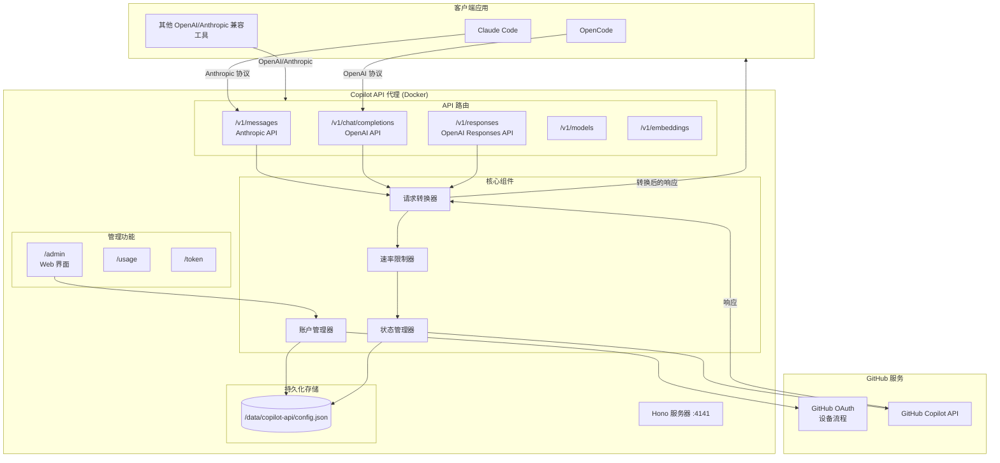
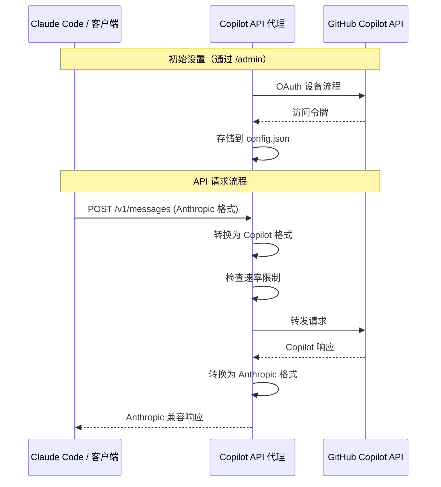

# Copilot API Proxy

**[English](README.md) | 中文**

> [!NOTE]
> **关于本分支**
> 本项目 fork 自 [ericc-ch/copilot-api](https://github.com/ericc-ch/copilot-api) 和 [yuegongzi/copilot-api](https://github.com/yuegongzi/copilot-api)。由于原作者已停止维护且不再支持新 API，我们对其进行了重新设计和重写。
> 特别感谢 [@ericc-ch](https://github.com/ericc-ch) 和 [@yuegongzi](https://github.com/yuegongzi) 的原创工作和贡献！

> [!WARNING]
> 这是一个 GitHub Copilot API 的逆向代理。它不受 GitHub 官方支持，可能会意外失效。使用风险自负。

> [!WARNING]
> **GitHub 安全提示：**  
> 过度的自动化或脚本化使用 Copilot（包括通过自动化工具进行的快速或批量请求）可能会触发 GitHub 的滥用检测系统。  
> 您可能会收到 GitHub 安全团队的警告，进一步的异常活动可能导致您的 Copilot 访问权限被暂时停用。
>
> GitHub 禁止使用其服务器进行过度的自动化批量活动或任何给其基础设施带来不当负担的活动。
>
> 请查阅：
>
> - [GitHub 可接受使用政策](https://docs.github.com/site-policy/acceptable-use-policies/github-acceptable-use-policies#4-spam-and-inauthentic-activity-on-github)
> - [GitHub Copilot 条款](https://docs.github.com/site-policy/github-terms/github-terms-for-additional-products-and-features#github-copilot)
>
> 请负责任地使用此代理，以避免账户受限。

---

**注意：** 如果您正在使用 [opencode](https://github.com/sst/opencode)，则不需要此项目。Opencode 已内置支持 GitHub Copilot 提供商。

---

## 项目概述

一个 GitHub Copilot API 的逆向代理，将其暴露为 OpenAI 和 Anthropic 兼容的服务。这使您可以将 GitHub Copilot 与任何支持 OpenAI Chat Completions API 或 Anthropic Messages API 的工具一起使用，包括 [Claude Code](https://docs.anthropic.com/en/docs/claude-code/overview)。

## 架构


```mermaid
flowchart TB
    subgraph Clients["客户端应用"]
        CC[Claude Code]
        OC[OpenCode]
        OTHER[其他 OpenAI/Anthropic 兼容工具]
    end

    subgraph Proxy["Copilot API 代理 (Docker)"]
        direction TB
        SERVER[Hono 服务器 :4141]
        
        subgraph Routes["API 路由"]
            ANTHROPIC["/v1/messages<br/>Anthropic API"]
            OPENAI["/v1/chat/completions<br/>OpenAI API"]
            RESPONSES["/v1/responses<br/>OpenAI Responses API"]
            MODELS["/v1/models"]
            EMBED["/v1/embeddings"]
        end
        
        subgraph Admin["管理功能"]
            ADMIN_UI["/admin<br/>Web 界面"]
            USAGE["/usage"]
            TOKEN_EP["/token"]
        end
        
        subgraph Core["核心组件"]
            TRANSLATOR[请求转换器]
            STATE[状态管理器]
            ACCOUNTS[账户管理器]
            RATE[速率限制器]
        end
        
        subgraph Storage["持久化存储"]
            CONFIG[("/data/copilot-api/config.json")]
        end
    end

    subgraph GitHub["GitHub 服务"]
        GH_OAUTH[GitHub OAuth<br/>设备流程]
        GH_COPILOT[GitHub Copilot API]
    end

    CC --> |Anthropic 协议| ANTHROPIC
    OC --> |OpenAI 协议| OPENAI
    OTHER --> |OpenAI/Anthropic| Routes

    ANTHROPIC --> TRANSLATOR
    OPENAI --> TRANSLATOR
    RESPONSES --> TRANSLATOR
    
    TRANSLATOR --> RATE
    RATE --> STATE
    STATE --> GH_COPILOT
    
    ADMIN_UI --> ACCOUNTS
    ACCOUNTS --> GH_OAUTH
    ACCOUNTS --> CONFIG
    STATE --> CONFIG

    GH_COPILOT --> |响应| TRANSLATOR
    TRANSLATOR --> |转换后的响应| Clients
```

## 请求流程


```mermaid
sequenceDiagram
    participant Client as Claude Code / 客户端
    participant Proxy as Copilot API 代理
    participant GitHub as GitHub Copilot API

    Note over Client,GitHub: 初始设置（通过 /admin）
    Proxy->>GitHub: OAuth 设备流程
    GitHub-->>Proxy: 访问令牌
    Proxy->>Proxy: 存储到 config.json

    Note over Client,GitHub: API 请求流程
    Client->>Proxy: POST /v1/messages (Anthropic 格式)
    Proxy->>Proxy: 转换为 Copilot 格式
    Proxy->>Proxy: 检查速率限制
    Proxy->>GitHub: 转发请求
    GitHub-->>Proxy: Copilot 响应
    Proxy->>Proxy: 转换为 Anthropic 格式
    Proxy-->>Client: Anthropic 兼容响应
```

## 功能特性

- **OpenAI & Anthropic 兼容**：将 GitHub Copilot 暴露为 OpenAI 兼容（`/v1/chat/completions`、`/v1/models`、`/v1/embeddings`、`/v1/responses`）和 Anthropic 兼容（`/v1/messages`）的 API。
- **Web 账户管理**：通过 `/admin` 的简单 Web 界面添加和管理多个 GitHub 账户。
- **多账户支持**：无需重启服务器即可在不同 GitHub 账户之间切换。
- **Docker 优先部署**：针对容器化部署进行优化，支持持久化数据存储。
- **使用量监控**：通过 `/usage` 端点查看 Copilot API 使用量和配额信息。
- **速率限制控制**：通过速率限制选项管理 API 使用，防止快速请求导致的错误。
- **支持不同账户类型**：适用于个人、商业和企业版 GitHub Copilot 计划。

## Docker 快速开始

### 使用 Docker Compose（推荐）

```bash
# 先设置一个真正的密码（或写到本地 .env 文件里）
export LOCAL_ACCESS_PASSWORD="$(openssl rand -base64 24)"

# 启动服务器
docker compose up -d

# 查看日志
docker compose logs -f
```

然后访问 **http://localhost:4141/admin** 添加您的 GitHub 账户。

提供的 Docker 配置会把 `4141` 端口只发布到 **localhost**。这是刻意为之：`/admin` 和 `/token` 是本地管理入口，不应该暴露到局域网。

### 使用 Docker Run

```bash
export LOCAL_ACCESS_PASSWORD="$(openssl rand -base64 24)"

docker run -d \
  --name copilot-api \
  -p 127.0.0.1:4141:4141 \
  -e HOST=0.0.0.0 \
  -e LOCAL_ACCESS_MODE=container-bridge \
  -e LOCAL_ACCESS_PASSWORD="${LOCAL_ACCESS_PASSWORD}" \
  -v copilot-data:/data \
  --restart unless-stopped \
  ghcr.io/zhuxu222/copilot-api:latest
```

`LOCAL_ACCESS_MODE=container-bridge` 是专门为“只发布到 localhost 的 Docker 用法”准备的显式开关。不要把它和 `-p 4141:4141` 或任何非 localhost 的端口发布方式一起使用。启用后，`/admin` 和 `/token` 还会额外要求 HTTP Basic Auth，用户名固定为 `copilot`，密码来自 `LOCAL_ACCESS_PASSWORD`。

## 账户设置

1. 使用 Docker 启动服务器
2. 在浏览器中打开 **http://localhost:4141/admin**（必须从 localhost 访问）
3. 点击"添加账户"开始 GitHub OAuth 设备流程
4. 在 GitHub 设备授权页面输入显示的代码
5. 授权完成后，您的账户将自动配置

管理面板允许您：

- 添加多个 GitHub 账户
- 在账户之间切换
- 删除账户
- 查看账户状态（个人/商业/企业）
- 在 `Settings` 页面配置全局限流

## 环境变量

| 变量 | 默认值 | 描述 |
|------|--------|------|
| `PORT` | `4141` | 服务器端口 |
| `HOST` | `127.0.0.1` | HTTP 监听地址。只有在确实需要容器端口发布时才设置为 `0.0.0.0` |
| `LOCAL_ACCESS_MODE` | `loopback` | `/admin` 和 `/token` 的访问策略。只有在容器端口发布到宿主机 `127.0.0.1` 时才使用 `container-bridge` |
| `LOCAL_ACCESS_PASSWORD` | - | 当 `LOCAL_ACCESS_MODE=container-bridge` 时必填。作为 `/admin` 和 `/token` 的 HTTP Basic Auth 密码，用户名固定为 `copilot` |
| `VERBOSE` | `false` | 启用详细日志（也接受 `DEBUG=true`） |
| `RATE_LIMIT` | - | 请求之间的最小间隔秒数 |
| `RATE_LIMIT_WAIT` | `false` | 达到速率限制时等待而不是返回错误 |
| `API_KEY` | - | 可选。设置后所有 `/v1/*` API 端点需要 `Authorization: Bearer <API_KEY>`。暴露 API 给局域网时建议设置 |
| `SHOW_TOKEN` | `false` | 在日志中显示令牌 |
| `PROXY_ENV` | `false` | 从环境变量使用 `HTTP_PROXY`/`HTTPS_PROXY` 作为备用代理 |

### 带选项的 Docker Compose 示例

```yaml
services:
  copilot-api:
    image: ghcr.io/yuegongzi/copilot-api:latest
    container_name: copilot-api
    ports:
      - "127.0.0.1:4141:4141"
    volumes:
      - copilot-data:/data
    environment:
      - PORT=4141
      - HOST=0.0.0.0
      - LOCAL_ACCESS_MODE=container-bridge
      - LOCAL_ACCESS_PASSWORD=${LOCAL_ACCESS_PASSWORD:?请先在 shell 或 .env 中设置}
      - VERBOSE=true
      - RATE_LIMIT=5
      - RATE_LIMIT_WAIT=true
    restart: unless-stopped

volumes:
  copilot-data:
```

如果没有通过环境变量设置 `RATE_LIMIT` / `RATE_LIMIT_WAIT`，也可以在管理页的 `Settings` 标签中配置。环境变量优先级高于页面保存的配置。

## API 端点

### OpenAI 兼容端点

| 端点 | 方法 | 描述 |
|------|------|------|
| `/v1/responses` | `POST` | OpenAI Responses API，用于生成模型响应 |
| `/v1/chat/completions` | `POST` | 聊天补全 API |
| `/v1/models` | `GET` | 列出可用模型 |
| `/v1/embeddings` | `POST` | 创建文本嵌入 |

### Anthropic 兼容端点

| 端点 | 方法 | 描述 |
|------|------|------|
| `/v1/messages` | `POST` | Anthropic Messages API |
| `/v1/messages/count_tokens` | `POST` | 令牌计数 |

### 管理端点

| 端点 | 方法 | 描述 |
|------|------|------|
| `/admin` | `GET` | 账户管理 Web 界面（仅限 localhost） |
| `/usage` | `GET` | Copilot 使用统计和配额 |
| `/token` | `GET` | 当前 Copilot 令牌 |

## 工具支持范围

本项目当前没有实现完整的 Claude Code / Codex 工具协议兼容层。工具支持以“尽量兼容”为主，范围主要受 GitHub Copilot 上游可稳定接受的工具形态限制。

- **明确支持**：通过 OpenAI 兼容或 Anthropic 兼容请求传入的标准 `function` 工具。
- **Responses 内建工具**：已支持 Copilot/OpenAI 风格的内建工具，包括 `file_search`、`code_interpreter`、`image_generation`、`local_shell`，前提是上游模型和 endpoint 本身支持。注意：`web_search` 和 `web_search_preview` **不被** GitHub Copilot API 支持——Anthropic 服务端工具（如 Claude Code 的 `WebSearch`）会被自动过滤。如需网页搜索功能，建议使用 MCP server fetch 工具作为客户端侧替代。
- **特殊兼容**：自定义 `apply_patch` 会被规范化为 `function` 工具，以提升兼容性。
- **有限的文件编辑兼容**：常见自定义文件编辑工具名，如 `write`、`write_file`、`writefiles`、`edit`、`edit_file`、`multi_edit`、`multiedit`，会被规范化为 `function` 工具，避免在代理层被直接过滤掉。
- **不保证兼容**：Claude Code、Codex、`superpowers` 或其他 agent 框架里的 skill 专用工具，如果依赖客户端自定义 schema、结果格式或特定执行语义，仍然可能失败，因为 Copilot 上游未必支持这些协议。
- **当前限制**：本项目还没有提供完整的 Claude Code / Codex 文件工具端到端兼容层。如果某个 skill 依赖私有工具契约，仍然需要额外做适配。

## 与 Claude Code 配合使用

通过创建 `.claude/settings.json` 文件来配置 Claude Code 使用此代理：

```json
{
  "env": {
    "ANTHROPIC_BASE_URL": "http://localhost:4141",
    "ANTHROPIC_AUTH_TOKEN": "sk-xxxx"
  },
  "model": "opus",
  "permissions": {
    "deny": ["WebSearch"]
  }
}
```

### 在管理页面配置模型映射

现在不需要再把模型映射硬编码在 `.claude/settings.json` 里。打开 `/admin`，切换到 `Model Mappings` 页面后，即可把 Claude Code 使用的模型别名映射到实际的 Copilot 模型。

这是目前更推荐的方式，适合统一管理 `haiku`、`sonnet`、`opus`、带日期的 Claude 模型 ID，以及其他客户端侧使用的模型名称，而不必反复修改本地 Claude Code 配置。


更多选项：[Claude Code 设置](https://docs.anthropic.com/en/docs/claude-code/settings#environment-variables)

### 可选：安装 copilot-api 的 Claude Code 插件

如果您希望 Claude Code 在 `SubagentStart` hook 中注入一个额外 marker，帮助 `copilot-api` 更稳定地区分 initiator override，可以直接从本仓库安装可选插件：

```bash
/plugin marketplace add https://github.com/zhuxu222/copilot-api.git
/plugin install copilot-api-subagent-marker@copilot-api-marketplace
```

这个插件只是一个轻量 hook 辅助层，不负责启动或管理 `copilot-api` 服务本身。服务端仍然建议按本文档中的 Docker 方式部署。

## 配置文件 (config.json)

配置文件存储在容器内的 `/data/copilot-api/config.json`（通过 Docker volume 持久化）。

```json
{
  "accounts": [
    {
      "id": "12345",
      "login": "github-user",
      "avatarUrl": "https://...",
      "token": "gho_xxxx",
      "accountType": "individual",
      "createdAt": "2025-01-27T...",
      "proxy": "http://10.62.216.80:8000"
    }
  ],
  "activeAccountId": "12345",
  "extraPrompts": {
    "gpt-5-mini": "<exploration prompt>"
  },
  "smallModel": "gpt-5-mini",
  "modelReasoningEfforts": {
    "gpt-5-mini": "low"
  }
}
```

### 配置选项

| 键 | 描述 |
|----|------|
| `accounts` | 已配置的 GitHub 账户列表（每个账户可包含可选的 `proxy` 字段） |
| `activeAccountId` | 当前活跃账户 ID |
| `extraPrompts` | 附加到系统消息的每模型提示 |
| `smallModel` | 预热请求的备用模型（默认：`gpt-5-mini`） |
| `modelReasoningEfforts` | 每模型推理强度（`none`、`minimal`、`low`、`medium`、`high`、`xhigh`） |
| `rateLimitSeconds` | 当未设置 `RATE_LIMIT` 环境变量时，保存的全局最小请求间隔 |
| `rateLimitWait` | 当未设置 `RATE_LIMIT_WAIT` 环境变量时，命中限流后的保存等待策略 |

## 按账号配置代理

每个 GitHub 账号可以配置独立的 HTTP(S) 代理。适用场景：

- 部分账号需要通过企业代理访问，其他账号直连
- 不同账号在不同网络环境中使用

### 配置方法

1. 打开管理面板 **http://localhost:4141/admin**
2. 在 **Accounts** 标签页，点击账号旁边的 **Set Proxy** 按钮
3. 输入代理 URL（如 `http://10.62.216.80:8000`），留空则直连
4. 代理设置对当前活跃账号立即生效

代理会应用于该账号的 Copilot API 调用和 GitHub API 调用（OAuth、Token 刷新、使用量查询）。

### 代理优先级

1. **账号级代理**（通过管理页面设置）— 最高优先级
2. **环境变量代理**（`PROXY_ENV=true` + `HTTP_PROXY`/`HTTPS_PROXY`）— 账号未配置代理时的备用方案
3. **直连** — 以上均未设置时

## 局域网访问

允许局域网内的其他设备使用 API：

```bash
export LOCAL_ACCESS_PASSWORD="$(openssl rand -base64 24)"
export API_KEY="$(openssl rand -base64 24)"  # 保护 API 端点

docker compose up -d
```

然后修改 `docker-compose.yml` 将端口发布到局域网：

```yaml
ports:
  - "4141:4141"  # 替代 127.0.0.1:4141:4141
```

**局域网访问的安全措施：**

- **管理面板 (`/admin`)**：HTTP Basic Auth 保护（用户名 `copilot`，密码来自 `LOCAL_ACCESS_PASSWORD`）
- **Token 端点 (`/token`)**：与管理面板相同保护
- **API 端点 (`/v1/*`)**：API Key 保护（`Authorization: Bearer <API_KEY>`）。未设置 `API_KEY` 时这些端点无需鉴权

局域网客户端配置示例：

```json
{
  "env": {
    "ANTHROPIC_BASE_URL": "http://<局域网IP>:4141",
    "ANTHROPIC_AUTH_TOKEN": "<API_KEY>"
  }
}
```

## 开发

### 前置要求

- Bun >= 1.2.x
- 拥有 Copilot 订阅的 GitHub 账户

### 命令

```bash
# 安装依赖
bun install

# 启动开发服务器（支持热重载）
bun run dev

# 类型检查
bun run typecheck

# 代码检查
bun run lint
bun run lint --fix

# 运行测试
bun test

# 生产构建
bun run build

# 检查未使用的代码
bun run knip
```

## 使用技巧

- **速率限制**：使用 `RATE_LIMIT` 防止触发 GitHub 的速率限制。设置 `RATE_LIMIT_WAIT=true` 可以队列请求而不是返回错误。
- **商业/企业账户**：账户类型在 OAuth 流程中自动检测。
- **多账户**：通过 `/admin` 添加多个账户，并根据需要在它们之间切换。

## Premium Interaction 说明

- **`premium_interactions` 来自 Copilot/GitHub 上游计量，不是这个代理自行定义的计费模型。** `/usage` 端点只是透传并展示上游返回的使用量数据。
- **Skill、hook、plan、subagent 等工作流可能会增加 `premium_interactions`。** 当客户端使用 Claude Code subagent 或 `superpowers` 一类能力时，Copilot 可能会把主交互和子代理交互视为不同的计费交互。
- **预热请求也可能被上游计入。** 本项目已经尝试通过将部分 warmup 风格请求切到 `smallModel` 来降低影响，但无法完全控制 Copilot 的上游计量方式。
- **这不是代理层可以彻底修复的问题。** 代理可以通过整理消息结构来尽量减少误计数，但无法覆盖 Copilot 在上游如何统计 interaction。
- **如果使用 subagent 后看到计数增加，并不代表代理重复转发了同一条业务请求。** 在正常路径下，代理对选定的上游 endpoint 只会转发一次请求，但 Copilot 仍可能对整个工作流统计多个 interaction。

## CLAUDE.md 推荐内容

请在 `CLAUDE.md` 中包含以下内容（供 Claude 使用）：

- 禁止直接向用户提问，必须使用 AskUserQuestion 工具。
- 一旦确认任务完成，必须使用 AskUserQuestion 工具让用户确认。用户如果对结果不满意可能会提供反馈，您可以利用这些反馈进行改进并重试。
