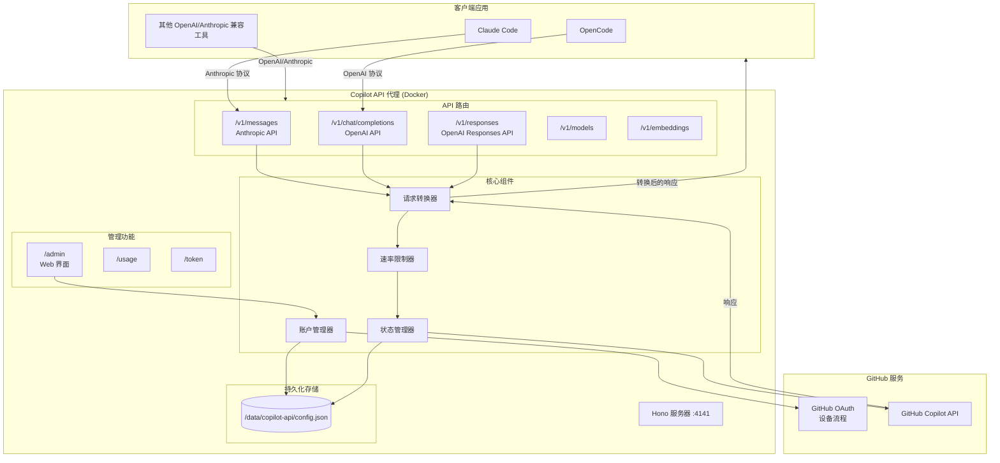
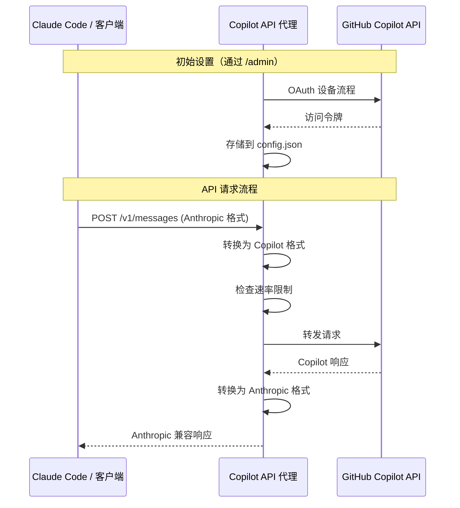

# Copilot API Proxy

**[English](README.md) | 中文**

> [!NOTE]
> **关于本分支**
> 本项目 fork 自 [ericc-ch/copilot-api](https://github.com/ericc-ch/copilot-api)。由于原作者已停止维护且不再支持新 API，我们对其进行了重新设计和重写。
> 特别感谢 [@ericc-ch](https://github.com/ericc-ch) 的原创工作和贡献！

> [!WARNING]
> 这是一个 GitHub Copilot API 的逆向代理。它不受 GitHub 官方支持，可能会意外失效。使用风险自负。

> [!WARNING]
> **GitHub 安全提示：**  
> 过度的自动化或脚本化使用 Copilot（包括通过自动化工具进行的快速或批量请求）可能会触发 GitHub 的滥用检测系统。  
> 您可能会收到 GitHub 安全团队的警告，进一步的异常活动可能导致您的 Copilot 访问权限被暂时停用。
>
> GitHub 禁止使用其服务器进行过度的自动化批量活动或任何给其基础设施带来不当负担的活动。
>
> 请查阅：
>
> - [GitHub 可接受使用政策](https://docs.github.com/site-policy/acceptable-use-policies/github-acceptable-use-policies#4-spam-and-inauthentic-activity-on-github)
> - [GitHub Copilot 条款](https://docs.github.com/site-policy/github-terms/github-terms-for-additional-products-and-features#github-copilot)
>
> 请负责任地使用此代理，以避免账户受限。

---

**注意：** 如果您正在使用 [opencode](https://github.com/sst/opencode)，则不需要此项目。Opencode 已内置支持 GitHub Copilot 提供商。

---

## 项目概述

一个 GitHub Copilot API 的逆向代理，将其暴露为 OpenAI 和 Anthropic 兼容的服务。这使您可以将 GitHub Copilot 与任何支持 OpenAI Chat Completions API 或 Anthropic Messages API 的工具一起使用，包括 [Claude Code](https://docs.anthropic.com/en/docs/claude-code/overview)。

## 架构



## 请求流程



## 功能特性

- **OpenAI & Anthropic 兼容**：将 GitHub Copilot 暴露为 OpenAI 兼容（`/v1/chat/completions`、`/v1/models`、`/v1/embeddings`、`/v1/responses`）和 Anthropic 兼容（`/v1/messages`）的 API。
- **Web 账户管理**：通过 `/admin` 的简单 Web 界面添加和管理多个 GitHub 账户。
- **多账户支持**：无需重启服务器即可在不同 GitHub 账户之间切换。
- **Docker 优先部署**：针对容器化部署进行优化，支持持久化数据存储。
- **使用量监控**：通过 `/usage` 端点查看 Copilot API 使用量和配额信息。
- **速率限制控制**：通过速率限制选项管理 API 使用，防止快速请求导致的错误。
- **支持不同账户类型**：适用于个人、商业和企业版 GitHub Copilot 计划。

## Docker 快速开始

### 使用 Docker Compose（推荐）

```bash
# 克隆仓库
git clone https://github.com/yuegongzi/copilot-api.git
cd copilot-api

# 启动服务器
docker compose up -d

# 查看日志
docker compose logs -f
```

然后访问 **http://localhost:4141/admin** 添加您的 GitHub 账户。

### 使用 Docker Run

```bash
docker run -d \
  --name copilot-api \
  -p 4141:4141 \
  -v copilot-data:/data \
  --restart unless-stopped \
  ghcr.io/yuegongzi/copilot-api:latest
```

## 账户设置

1. 使用 Docker 启动服务器
2. 在浏览器中打开 **http://localhost:4141/admin**（必须从 localhost 访问）
3. 点击"添加账户"开始 GitHub OAuth 设备流程
4. 在 GitHub 设备授权页面输入显示的代码
5. 授权完成后，您的账户将自动配置

管理面板允许您：

- 添加多个 GitHub 账户
- 在账户之间切换
- 删除账户
- 查看账户状态（个人/商业/企业）

## 环境变量

| 变量 | 默认值 | 描述 |
|------|--------|------|
| `PORT` | `4141` | 服务器端口 |
| `VERBOSE` | `false` | 启用详细日志（也接受 `DEBUG=true`） |
| `RATE_LIMIT` | - | 请求之间的最小间隔秒数 |
| `RATE_LIMIT_WAIT` | `false` | 达到速率限制时等待而不是返回错误 |
| `SHOW_TOKEN` | `false` | 在日志中显示令牌 |
| `PROXY_ENV` | `false` | 从环境变量使用 `HTTP_PROXY`/`HTTPS_PROXY` |

### 带选项的 Docker Compose 示例

```yaml
services:
  copilot-api:
    image: ghcr.io/yuegongzi/copilot-api:latest
    container_name: copilot-api
    ports:
      - "4141:4141"
    volumes:
      - copilot-data:/data
    environment:
      - PORT=4141
      - VERBOSE=true
      - RATE_LIMIT=5
      - RATE_LIMIT_WAIT=true
    restart: unless-stopped

volumes:
  copilot-data:
```

## API 端点

### OpenAI 兼容端点

| 端点 | 方法 | 描述 |
|------|------|------|
| `/v1/responses` | `POST` | OpenAI Responses API，用于生成模型响应 |
| `/v1/chat/completions` | `POST` | 聊天补全 API |
| `/v1/models` | `GET` | 列出可用模型 |
| `/v1/embeddings` | `POST` | 创建文本嵌入 |

### Anthropic 兼容端点

| 端点 | 方法 | 描述 |
|------|------|------|
| `/v1/messages` | `POST` | Anthropic Messages API |
| `/v1/messages/count_tokens` | `POST` | 令牌计数 |

### 管理端点

| 端点 | 方法 | 描述 |
|------|------|------|
| `/admin` | `GET` | 账户管理 Web 界面（仅限 localhost） |
| `/usage` | `GET` | Copilot 使用统计和配额 |
| `/token` | `GET` | 当前 Copilot 令牌 |

## 与 Claude Code 配合使用

通过创建 `.claude/settings.json` 文件来配置 Claude Code 使用此代理：

```json
{
  "env": {
    "ANTHROPIC_BASE_URL": "http://localhost:4141",
    "ANTHROPIC_AUTH_TOKEN": "sk-xxxx",
    "ANTHROPIC_DEFAULT_HAIKU_MODEL": "claude-haiku-4.5",
    "ANTHROPIC_DEFAULT_SONNET_MODEL": "claude-sonnet-4.5",
    "ANTHROPIC_DEFAULT_OPUS_MODEL": "claude-opus-4.5",
    "CLAUDE_CODE_SUBAGENT_MODEL": "claude-sonnet-4.5"
  },
  "model": "opus",
  "permissions": {
    "deny": ["WebSearch"]
  }
}
```

更多选项：[Claude Code 设置](https://docs.anthropic.com/en/docs/claude-code/settings#environment-variables)

## 配置文件 (config.json)

配置文件存储在容器内的 `/data/copilot-api/config.json`（通过 Docker volume 持久化）。

```json
{
  "accounts": [
    {
      "id": "12345",
      "login": "github-user",
      "avatarUrl": "https://...",
      "token": "gho_xxxx",
      "accountType": "individual",
      "createdAt": "2025-01-27T..."
    }
  ],
  "activeAccountId": "12345",
  "extraPrompts": {
    "gpt-5-mini": "<exploration prompt>"
  },
  "smallModel": "gpt-5-mini",
  "modelReasoningEfforts": {
    "gpt-5-mini": "low"
  }
}
```

### 配置选项

| 键 | 描述 |
|----|------|
| `accounts` | 已配置的 GitHub 账户列表 |
| `activeAccountId` | 当前活跃账户 ID |
| `extraPrompts` | 附加到系统消息的每模型提示 |
| `smallModel` | 预热请求的备用模型（默认：`gpt-5-mini`） |
| `modelReasoningEfforts` | 每模型推理强度（`none`、`minimal`、`low`、`medium`、`high`、`xhigh`） |

## 开发

### 前置要求

- Bun >= 1.2.x
- 拥有 Copilot 订阅的 GitHub 账户

### 命令

```bash
# 安装依赖
bun install

# 启动开发服务器（支持热重载）
bun run dev

# 类型检查
bun run typecheck

# 代码检查
bun run lint
bun run lint --fix

# 运行测试
bun test

# 生产构建
bun run build

# 检查未使用的代码
bun run knip
```

## 使用技巧

- **速率限制**：使用 `RATE_LIMIT` 防止触发 GitHub 的速率限制。设置 `RATE_LIMIT_WAIT=true` 可以队列请求而不是返回错误。
- **商业/企业账户**：账户类型在 OAuth 流程中自动检测。
- **多账户**：通过 `/admin` 添加多个账户，并根据需要在它们之间切换。

## CLAUDE.md 推荐内容

请在 `CLAUDE.md` 中包含以下内容（供 Claude 使用）：

- 禁止直接向用户提问，必须使用 AskUserQuestion 工具。
- 一旦确认任务完成，必须使用 AskUserQuestion 工具让用户确认。用户如果对结果不满意可能会提供反馈，您可以利用这些反馈进行改进并重试。
